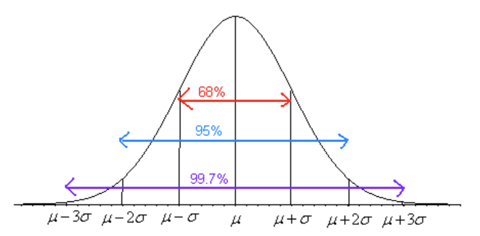

# Continuous Probability Distributions

```{r, include=FALSE}
library("mosaic")
library("NHANES")
```

Chapter 5 dealt with probability distributions arising from discrete random variables. Mostly that chapter focused on the binomial experiment. There are many other experiments from discrete random variables that exist but are not covered in this book.

Chapter 6 deals with probability distributions that arise from continuous random variables. The focus of this chapter is a distribution known as the normal distribution, though realize that there are many other distributions that exist. A few others are examined in future chapters.

Looking at the density plot of a quantitative variable, one can guess what the distribution of that variable is. As an example, consider the NHANES data frame. One variable to consider is Weight. The density plot of Weight is

**Graph 6.1: Density Plot of Weight of a Person**

```{r, warning=FALSE, echo=FALSE}
gf_density(~Weight, data=NHANES)
```

This graph looks somewhat symmetric, and maybe bell shaped.

Consider, the variable head circumference (HeadCirc) in the NHANES data frame. The density plot for this variable is

**Graph 6.2: Density Plot of Head Circumference of a Person**

```{r, warning=FALSE, echo=FALSE}
gf_density(~HeadCirc, data=NHANES)
```

This graph looks somewhat skewed left.

Now consider the variable BMI from the NHANES data frame. The density plot is

**Graph 6.3: Density Plot of BMI of a Person**

```{r, warning=FALSE, echo=FALSE}
gf_density(~BMI, data=NHANES)
```

This density plot appears to be skewed left.

Now consider the variable SmokeAge. Its density plot is

**Graph 6.4: Density Plot of Age when Person Started Smoking**

```{r, warning=FALSE, echo=FALSE}
gf_density(~SmokeAge, data=NHANES)
```

This distribution appears to be bimodal.

lastly, consider the variable Pulse. The density plot is

**Graph 6.5: Density Plot of Pulse Rate of a person**

```{r, warning=FALSE, echo=FALSE}
gf_density(~Pulse, data=NHANES)
```

This density plot appears to be symmetric and could almost be considered bell shaped. 

The reason that one considers the density plots to understand the distribution of the population, is that in some cases the distribution can be approximated with a known distribution that has certain properties. There are many known distribution. Some examples are the Uniform distribution, the Chi-Squared distribution, the Student's T distribution, and the normal distribution. The normal distribution is one of the more common distributions to use as a model, and it will be explored in this chapter. But do realize that there are many other distributions that one can use.

** Normal Distribution **

>Many populations have a distribution that is a symmetric, unimodal, and bell-shaped. For example: height, blood pressure, and cholesterol level. However, not every bell shaped curve is a normal curve. In a normal curve, there is a specific relationship between its "height" and its "width."
>Normal curves can be tall and skinny or they can be short and fat. They are all symmetric, unimodal, and centered at $\mu$, the population mean. Graph \#6.6 shows two different normal curves drawn on the same scale. Both have $\mu=2$ but the one in Graph \#5.6a has a standard deviation of 1 and the one in Graph \#6.5b has a standard deviation of 4. Notice that the larger standard deviation makes the graph wider (more spread out) and shorter.

**Graph \#6.6a: Normal Distribution Graph with $\mu=2$, and $\sigma=1$**

```{r, echo=FALSE}
cord.x <- c(-2, seq(-2, 7, .1),-1) 
cord.y <- c(0,dnorm(seq(-2, 7, .1), 2, 1),0) 
curve(dnorm(x, 2, 1),xlim=c(2-3*4,2+3*4)) 
polygon(cord.x,cord.y)
```

**Graph \#6.6b: Normal Distribution Graph with $\mu = 2$, and $\sigma = 4$**

```{r, echo=FALSE}
cord.x <- c(-10, seq(-10, 15, .1),-1) 
cord.y <- c(0,dnorm(seq(-10, 15, .1), 2, 4),0) 
curve(dnorm(x, 2, 4),xlim=c(2-3*4,2+3*4), ylim=c(0,0.4)) 
polygon(cord.x,cord.y)
```

>Every normal curve has common features.
>
-   The center, or the highest point, is at the population mean, $\mu$.
-   The transition points are the places where the curve changes from a "hill" to a "valley". The distance from the mean to the transition point is one standard deviation, .
-   The area under the whole curve is exactly 1. Therefore, the area under the half below or above the mean is 0.5.

>Just as in a discrete probability distribution, the object is to find the probability of an event occurring. However, unlike in a discrete probability distribution where the event can be a single value, in a continuous probability distribution the event must be a range. You are interested in finding the probability of *x* occurring in the range between *a* and *b*, or $P(a \le x \le b) = P(a<x<b)$. Calculus tells us this probability is the area under the curve in the interval from *a* to *b*.

**\
**

>Before looking at the process for finding the probabilities under the normal curve, it is somewhat useful to look at the **Empirical Rule** that gives approximate values for these areas. The Empirical Rule is just an approximation and it will only be used in this section to give you an idea of what the size of the probabilities is for different shadings. A more precise method for finding probabilities for the normal curve will be demonstrated in the next section. Please do not use the
empirical rule except for real rough estimates.

>**The Empirical Rule** for any normal distribution:
Approximately 68% of the data is within one standard deviation of the
mean.
Approximately 95% of the data is within two standard deviations of the
mean.
Approximately 99.7% of the data is within three standard deviations of
the mean.

**\
**

**Graph \#6.7: Empirical Rule**



Be careful, there is still some area left over in each end. Remember,
the maximum a probability can be is 100%, so if you calculate you will
see that for both ends together there is 0.3% of the curve. Because of
symmetry, you can divide this equally between both ends and find that
there is 0.15% in each tail beyond the .

**\
**

## Finding Probabilities for the Normal Distribution

The Empirical Rule is just an approximation and only works for certain values. What if you want to find the probability for *x* values that are not integer multiples of the standard deviation? The probability is the area under the curve. To find areas under the curve, you need calculus. Before technology, you needed to convert every *x* value to a standardized number, called the *z*-score or *z-*value or simply just *z*. The *z*-score is a measure of how many standard deviations an *x* value is from the mean. To convert from a normally distributed *x* value to a *z*-score, you use the following formula.

***z*-score**
$=\frac{x-\mu}{\sigma}$

where $\mu$ = mean of the population of the *x* value and $\sigma$ = standard deviation for the population of the *x* value

The *z*-score is normally distributed, with a mean of 0 and a standard deviation of 1. It is known as the standard normal curve. The z-score is a measure of how many standard deviations a data value is from its mean. If the z-score is positive, the data value is above the mean. If the z-score is negative, the data value is below the mean. The farther the z-value is from 0, the farther the data value is from the mean. 

These days technology can find probabilities without converting to the *z*-score and looking the probabilities up in a table. There are many programs available that will calculate the probability for a normal curve. The command on R to find the area to the left is $P(x<value)$=pnorm(value, mean, standard deviation, lower.tail=TRUE). The command on R to find the area to the right is $P(x>value)$=pnorm(value, mean, standard deviation, lower.tail=FALSE).

### Example: General Normal Distribution**

> The length of a human pregnancy is normally distributed with a mean of 272 days with a standard deviation of 9 days (Bhat & Kushtagi, 2006).

a.  State the random variable.

> **Solution:**
>
> *x* = length of a human pregnancy

b.  Find the probability of a pregnancy lasting more than 280 days.

> **Solution:**
>
> First translate the statement into a mathematical statement. $P(x>280)$
>
> Now, draw a picture.

**Graph \#6.1.1: Normal Distribution Graph for $P(x>280)$**

```{r, echo=FALSE}
cord.x <- c(280,seq(280,340,0.01),340) 
cord.y <- c(0,dnorm(seq(280,340,0.01),272,9),0) 
curve(dnorm(x,272,9),xlim=c(230,320),main= "Pregnancy Length ") 
polygon(cord.x,cord.y,col='skyblue')
```

The probability of a pregnancy lasting longer than 280 days is $P(x>280)=0.187$. The command in R Studio is

```{r}
pnorm(280, 272, 9, lower.tail=FALSE)
```
>
> Thus 18.7% of all pregnancies last more than 280 days. This is not
> unusual since the probability is greater than 5%.

c.  Find the probability of a pregnancy lasting less than 250 days.

> **Solution:**
>
> First translate the statement into a mathematical statement. $P(x<250)$
>
> Now, draw a picture. 

**Graph \#6.1.2: Normal Distribution Graph for $P(x<250)$**

```{r, echo=FALSE}
cord.x <- c(150,seq(150,250,0.01),250) 
cord.y <- c(0,dnorm(seq(150,250,0.01),272,9),0) 
curve(dnorm(x,272,9),xlim=c(230,320),main= "Pregnancy Length ") 
polygon(cord.x,cord.y,col='skyblue')
```

The probability of a pregnancy lasting longer than 250 days is $P(x<250)=0.0073$. The command in R Studio is

```{r}
pnorm(250, 272, 9, lower.tail=TRUE)
```
>
> Thus 0.73% of all pregnancies last less than 250 days. This is unusual
> since the probability is less than 5%.

d.  Find the probability that a pregnancy lasts between 265 and 280
    days.

> **Solution:**
>
> First translate the statement into a mathematical statement. $P(265<x<280)$
>
> Now draw a picture.
>
>**Graph \#6.1.3: Normal Distribution Graph for $P(265<x<280)$**

```{r, echo=FALSE}
cord.x <- c(265,seq(265,280,0.01),280) 
cord.y <- c(0,dnorm(seq(265,280,0.01),272,9),0) 
curve(dnorm(x,272,9),xlim=c(230,320),main= "Pregnancy Length") 
polygon(cord.x,cord.y,col='skyblue')
```

The probability of a pregnancy lasting between 265 days and 280 days is $P(265<x<280)=0.187$. To find the area between two values on the normal distribution, first, find the area to the left of the lower value, Graphically, this looks like
>
>**Graph \#6.1.4: Normal Distribution Graph for $P(x<265)$**
>
```{r, echo=FALSE}
cord.x <- c(265,seq(150,265,0.01),265) 
cord.y <- c(0,dnorm(seq(150,265,0.01),272,9),0) 
curve(dnorm(x,272,9),xlim=c(230,320),main= "Pregnancy Length") 
polygon(cord.x,cord.y,col='green')
```

>Now find the area less than 280. Graphically this looks like
>
>**Graph \#6.1.5: Normal Distribution Graph for $P(x<280)$**

```{r, echo=FALSE}
cord.x <- c(265,seq(150,280,0.01),280) 
cord.y <- c(0,dnorm(seq(150,280,0.01),272,9),0) 
curve(dnorm(x,272,9),xlim=c(230,320),main= "Pregnancy Length ") 
polygon(cord.x,cord.y,col='blue')
```

>Looking at the three graphs, if you take the area in Graph \#6.1.5 and subtract the area in Graph \#6.1.4, you get the area in the Graph \#6.1.3. In R Studio, the way to find the probability the probability of a pregnancy lasting between 265 days and 280 days, $P(265<x<280)=0.595$ use the following command 

```{r}
pnorm(280, 272, 9, lower.tail=TRUE)-pnorm(265, 272, 9, lower.tail=TRUE)
```
>
> Thus 59.5% of all pregnancies last between 265 and 280 days.

e.  Find the length of pregnancy that 10% of all pregnancies last less than.

> **Solution:**
>
> This problem is asking you to find an *x* value from a probability.
> You want to find the *x* value that has 10% of the length of pregnancies to the left of it. In this case, you are given the probability. In R, the command is qnorm(area, mean, standard deviation, lower.tail=TRUE or FALSE). For this example since you know the area in the lower tail, then use lower.tail=TRUE. So the command is

```{r}
qnorm(0.1, 272, 9, lower.tail = TRUE)
```
>
> Thus 10% of all pregnancies last less than approximately 260 days.

f.  Suppose you meet a woman who says that she was pregnant for less
    than 250 days. Would this be unusual and what might you think?

> **Solution:**
>
> From part (c) you found the probability that a pregnancy lasts less than 250 days is 0.73%. Since this is less than 5%, it is very unusual. You would think that either the woman had a premature baby, or that she may be wrong about when she actually became pregnant.

### Example: General Normal Distribution**

The mean mathematics SAT score in 2012 was 514 with a standard deviation of 117 (\"Total group profile,\" 2012). Assume the mathematics SAT score is normally distributed.

a.  State the random variable.

> **Solution:**
>
> *x* = mathematics SAT score

b.  Find the probability that a person has a mathematics SAT score
    over 700.

> **Solution:**
>
> First translate the statement into a mathematical statement. P(x>700)
>
> Now, draw a picture.

**Graph \#6.1.6: Normal Distribution Graph for SAT Mathematics Score**

```{r, echo=FALSE}
cord.x <- c(700,seq(700,1200,0.01),700) 
cord.y <- c(0,dnorm(seq(700,1200,0.01),514,117),0) 
curve(dnorm(x,514,117),xlim=c(100,1100),main= "SAT Mathematics Score ") 
polygon(cord.x,cord.y,col='skyblue')
```

To find $P(x>700)=0.0559$, the command in R would be

```{r}
pnorm(700, 514,117, lower.tail = FALSE)
```
> There is a 5.6% chance that a person scored above a 700 on the mathematics SAT test. This is not unusual.

c.  Find the probability that a person has a mathematics SAT score of less than 400.

> **Solution:**
>
> First translate the statement into a mathematical statement. $P(x<400)$
>
> Now, draw a picture. 

**Graph \#6.1.7: Normal Distribution for Mathematics SAT Score**

```{r, echo=FALSE}
cord.x <- c(700,seq(100,400,0.01),400) 
cord.y <- c(0,dnorm(seq(100,400,0.01),514,117),0) 
curve(dnorm(x,514,117),xlim=c(100,1100),main= "SAT Mathematics Score ") 
polygon(cord.x,cord.y,col='skyblue')
```

To find $P(x<400)=0.165$, the command in R would be

```{r}
pnorm(400, 514, 117, lower.tail = TRUE)
```
>
> So, there is a 16.5% chance that a person scores less than a 400 on the mathematics part of the SAT.

d.  Find the probability that a person has a mathematics SAT score between a 500 and a 650.

> **Solution:**
>
> First translate the statement into a mathematical statement $P(500<x<650)
>
> Now, draw a picture.

**Graph \#6.1.9: Normal Distribution Graph for SAT Mathematics Score**

```{r, echo=FALSE}
cord.x <- c(500,seq(500,650,0.01),650) 
cord.y <- c(0,dnorm(seq(500,650,0.01),514,117),0) 
curve(dnorm(x,514,117),xlim=c(100,1100),main= "SAT Mathematics Score ") 
polygon(cord.x,cord.y,col='skyblue')
```

To find $P(500<x<650)=0.425$, the command in R would be

```{r}
pnorm(650, 514, 117, lower.tail = TRUE)-pnorm(500, 514, 117, lower.tail=TRUE)
```
>
> So, there is a 42.5% chance that a person has a mathematical SAT score between 500 and 650.

e.  Find the mathematics SAT score that represents the top 1% of all scores.

> **Solution:**
>
> This problem is asking you to find an *x* value from a probability. You want to find the *x* value that has 1% of the mathematics SAT scores to the right of it. In this case you are using the upper tail of the curve.
To find this x value on R Studio, use the command

```{r}
qnorm(0.01, 514, 117, lower.tail=FALSE)
```
>
> So, 1% of all people who took the SAT scored over about 786 points on the mathematics SAT.

### Homework Section 6.1

>1.  Find each of the probabilities, where *z* is a *z*-score from the standard normal distribution with mean of $\mu=0$ and standard deviation $\sigma=1$. It helps to draw a picture for each problem. 
>
 a.) $P(z<2.36)$
 b.) $P(z>0.67)$
 c.) $P(0<x<2.11)$
 d.) $P(-2.78<z<1.97)$

>2.  Find the *z*-score corresponding to the given area. Remember, *z* is     distributed as the standard normal distribution with mean of [MISSING EQ] and     standard deviation  [MISSING EQ].
>
a.  The area to the left of *z* is 15%.
b.  The area to the right of *z* is 65%.
c.  The area to the left of *z* is 10%.
d.  The area to the right of *z* is 5%.
e.  The area between and *z* is 95%. (Hint draw a picture and figure out the area to the left of the.)
f.  The area between and *z* is 99%.

>3.  If a random variable that is normally distributed has a mean of 25 and a standard deviation of 3, convert the given value to a *z*-score.
>
a.  *x* = 23
b.  *x* = 33
c.  *x* = 19
d.  *x* = 45

>4.  According to the WHO MONICA Project the mean blood pressure for people in China is 128 mmHg with a standard deviation of 23 mmHg (Kuulasmaa, Hense & Tolonen, 1998). Assume that blood pressure is normally distributed.
>
a.  State the random variable.
b.  Find the probability that a person in China has blood pressure of 135 mmHg or more.
c.  Find the probability that a person in China has blood pressure of 141 mmHg or less.
d.  Find the probability that a person in China has blood pressure between 120 and 125 mmHg.
e.  Is it unusual for a person in China to have a blood pressure of 135 mmHg? Why or why not?
f.  What blood pressure do 90% of all people in China have less than?

>5.  The size of fish is very important to commercial fishing. A study conducted in 2012 found the length of Atlantic cod caught in nets in Karlskrona to have a mean of 49.9 cm and a standard deviation of 3.74 cm (Ovegard, Berndt & Lunneryd, 2012). Assume the length of fish is normally distributed.
>
a.  State the random variable.
b.  Find the probability that an Atlantic cod has a length less than 52 cm.
c.  Find the probability that an Atlantic cod has a length of more than 74 cm.
d.  Find the probability that an Atlantic cod has a length between 40.5 and 57.5 cm.
e.  If you found an Atlantic cod to have a length of more than 74 cm, what could you conclude?
f.  What length are 15% of all Atlantic cod longer than?

>6.  The mean cholesterol levels of women age 45-59 in Ghana, Nigeria, and Seychelles is 5.1 mmol/l and the standard deviation is 1.0 mmol/l (Lawes, Hoorn, Law & Rodgers, 2004). Assume that cholesterol levels are normally distributed.
>
a.  State the random variable.
b.  Find the probability that a woman age 45-59 in Ghana, Nigeria, or Seychelles has a cholesterol level above 6.2 mmol/l (considered a high level).
c.  Find the probability that a woman age 45-59 in Ghana, Nigeria, or Seychelles has a cholesterol level below 5.2 mmol/l (considered a normal level).
d.  Find the probability that a woman age 45-59 in Ghana, Nigeria, or Seychelles has a cholesterol level between 5.2 and 6.2 mmol/l (considered borderline high).
e.  If you found a woman age 45-59 in Ghana, Nigeria, or Seychelles having a cholesterol level above 6.2 mmol/l, what could you conclude?
f.  What value do 5% of all woman ages 45-59 in Ghana, Nigeria, or Seychelles have a cholesterol level less than?

>7.  In the United States, males between the ages of 40 and 49 eat on average 103.1 g of fat every day with a standard deviation of 4.32 g (\"What we eat,\" 2012). Assume that the amount of fat a person eats is normally distributed.
>
a.  State the random variable.
b.  Find the probability that a man age 40-49 in the U.S. eats more than 110 g of fat every day.
c.  Find the probability that a man age 40-49 in the U.S. eats less than 93 g of fat every day.
d.  Find the probability that a man age 40-49 in the U.S. eats less than 65 g of fat every day.
e.  If you found a man age 40-49 in the U.S. who says he eats less than 65 g of fat every day, would you believe him? Why or why not?
f.  What daily fat level do 5% of all men age 40-49 in the U.S. eat more than?

>8.  A dishwasher has a mean life of 12 years with an estimated standard deviation of 1.25 years (\"Appliance life expectancy,\" 2013). Assume the life of a dishwasher is normally distributed.
>
a.  State the random variable.
b.  Find the probability that a dishwasher will last more than 15 years.
c.  Find the probability that a dishwasher will last less than 6 years.
d.  Find the probability that a dishwasher will last between 8 and 10 years.
e.  If you found a dishwasher that lasted less than 6 years, would you think that you have a problem with the manufacturing process? Why or why not?
f.  A manufacturer of dishwashers only wants to replace free of charge 5% of all dishwashers. How long should the manufacturer make the warranty period?

>9.  The mean starting salary for nurses is \$67,694 nationally (\"Staff nurse -,\" 2013). The standard deviation is approximately \$10,333. Assume that the starting salary is normally distributed.
>
a.  State the random variable.
b.  Find the probability that a starting nurse will make more than \$80,000.
c.  Find the probability that a starting nurse will make less than \$60,000.
d.  Find the probability that a starting nurse will make between \$55,000 and \$72,000.
e.  If a nurse made less than \$50,000, would you think the nurse was under paid? Why or why not?
f.  What salary do 30% of all nurses make more than?

>10. The mean yearly rainfall in Sydney, Australia, is about 137 mm and the standard deviation is about 69 mm (\"Annual maximums of,\ "2013). Assume rainfall is normally distributed.
>
a.  State the random variable.
b.  Find the probability that the yearly rainfall is less than 100 mm.
c.  Find the probability that the yearly rainfall is more than 240 mm.
d.  Find the probability that the yearly rainfall is between 140 and 250 mm.
e.  If a year has a rainfall less than 100mm, does that mean it is an unusually dry year? Why or why not?
f.  What rainfall amount are 90% of all yearly rainfalls more than?

**\
**

## Assessing Normality

The distributions you have seen up to this point have been assumed to be normally distributed, but how do you determine if it is normally distributed. One way is to take a sample and look at the sample to determine if it appears normal. If the sample looks normal, then most likely the population is also. Here are some guidelines that are use to help make that determination.

1.  **Density Plot:** Make a density plot. For a normal distribution, the density plot should be roughly bell-shaped. For small samples, this is not very accurate, and another method is needed. A distribution may not look normally distributed from the density plot, but it still may be normally distributed.

2.  **Normal quantile plot (or normal probability plot):** This plot is provided through statistical software on a computer. If the points lie close to a line, the data comes from a distribution that is approximately normally distributed. If the points do not lie close to a line or they show a pattern that is not a line, the data are likely to come from a distribution that is not normally distributed.

> **To create a density plot on R Studio:**
>
> Read the Data Frame into R Studio. The command for density is gf_density(~variable, data=Data Frame). See section 2.2 for more examples of this..
>
> **To create a normal quantile plot on R Studio:**
>
> Read the Data Frame into R Studio. The command for normal quantile plot is gf_qqnorm(~variable, data=Data Frame). 

Realize that your random variable may be normally distributed, even if the sample fails the two tests. However, if the density plot definitely doesn't look symmetric and bell shaped, and the normal probability plot doesn't look linear, then you can be fairly confident that the data set does not come from a population that is normally distributed.

### Example: Is It Normal?**

In Kiama, NSW, Australia, there is a blowhole. The data in table \#6.2.1 are times in seconds between eruptions (\"Kiama blowhole eruptions,\" 2013). Do the data come from a population that is normally distributed?

**Table \#6.2.1: Time (in Seconds) Between Kiama Blowhole Eruptions **

```{r}
Eruption<-read.csv("https://krkozak.github.io/MAT160/Blowhole_eruptions.csv")
head(Eruption)
```
 **Code book for Data Frame Eruption**

**Description**
> The ocean swell produces spectacular eruptions of water through a hole in the cliff at Kiama, about 120km south of Sydney, known as the Blowhole. The times at which 65 successive eruptions occurred from 1340 hours on 12 July 1998 were observed using a digital watch.				

**Usage**
> Eruption

**Format**
> This data frame contains the following columns:

> Interval: Waiting time between eruptions (seconds)

**Source**
Kiama Blowhole Eruptions. (n.d.). Retrieved from http://www.statsci.org/data/oz/kiama.html

**References**
The data was collected and contributed by Jim Irish, Faculty of Engineering, University of Technology, Sydney.

a.  State the random variable

> **Solution:**
>
> *x* = time in seconds between eruptions of Kiama Blowhole

b.  Draw a Density plot

> **Solution:**
>
> The density plot produced is in Graph \#6.2.1.
>
> **Graph \#6.2.1: Density Plot for Kiama Blowhole**

```{r}
gf_density(~Interval, data=Eruption, title="Eruption times for Kiama Blowhole")
```

This looks skewed right and not symmetric.

c.  Draw the normal quantile plot.

> **Solution:**
>
> The normal quantile plot is in Graph \#6.2.2.
>
> **Graph \#6.2.2: Normal Probability Plot**

```{r}
gf_qq(~Interval, data=Eruption, title="Eruption times for Kiama Blowhole")
```

This graph looks more like an exponential growth than linear.

e.  Do the data come from a population that is normally distributed?

> **Solution:**
>
> Considering the density plot is skewed right, and the normal probability plot does not look linear, then the conclusion is that this sample is not from a population that is normally distributed.

### Example: Is It Normal?**

The US National Center for Health Statistics (NCHS) conducted a series of health and nutrition surveys called NHANES. One of the many variables in NHANES is pulse. Determine if pulse is a normally distributed variable.

**Table \#6.2.2: NHANES**

```{r, echo=FALSE}
head(NHANES)
```

a.  State the random variable

> **Solution:**
>
> *x* = pulse

b.  Draw a density plot

> **Solution:**
>
> The density plot is in Graph \#6.2.3.
>
> **Graph \#6.2.3: Density Plot for Pulse**

```{r, warning=FALSE}
gf_density(~Pulse, data=NHANES, title="Pulse Rate")
```

This looks somewhat symmetric.

c.  Draw the normal quantile plot.

> **Solution:**
>
> The normal quantile plot is in Graph \#6.2.4.
>
> **Graph \#6.2.4: Normal Quantile Plot**

```{r, warning=FALSE}
gf_qq(~Pulse, data=NHANES, title="Pulse Rate")
```

This graph looks fairly linear.

e.  Do the data come from a population that is normally distributed?

> **Solution:**
>
> Considering the density plot is bell shaped and the normal probability plot looks linear. The conclusion is that this sample is from a population that is normally distributed.

### Homework Section 6.2

1.  Cholesterol data was collected on patients four days after having a heart attack. The data is in table \#6.2.3. Assess if the data is from a population that is normally distributed.

> **Table \#6.2.3: Cholesterol Data Collected Four Days After a Heart Attack**

```{r}
Cholesterol<-read.csv("https://krkozak.github.io/MAT160/cholesterol.csv")
head(Cholesterol)
```

**Code Book for Cholesterol** See problem 3.1.1 in Section 3.1 homework.

2.  The size of fish is very important to commercial fishing. A study conducted in 2012 collected the lengths of Atlantic cod caught in nets in Karlskrona (Ovegard, Berndt & Lunneryd, 2012). Data based on information from the study is in table \#6.2.4. Determine if the data is from a population that is normally distributed.

> **Table \#6.2.4: Atlantic Cod Lengths**

```{r}
Cod<-read.csv("https://krkozak.github.io/MAT160/cod.csv")
head(Cod)
```


3.  The WHO MONICA Project collected blood pressure data for people in     China (Kuulasmaa, Hense & Tolonen, 1998). Data based on information from the study is in table \#6.2.5. Determine if the data is from a  population that is normally distributed.

> **Table \#6.2.5: Blood Pressure Values for People in China**

```{r}
BP<-read.csv("https://krkozak.github.io/MAT160/bp.csv")
head(BP)
```

4.  Annual rainfalls for Sydney, Australia are given in table \#6.2.6. (\"Annual maximums of,\" 2013). Can you assume rainfall is normally distributed?

    **Table \#6.2.6: Annual Rainfall in Sydney, Australia**
    
```{r}
Annual<-read.csv("https://krkozak.github.io/MAT160/annual.csv")
head(Annual)
```


**\
**

## Sampling Distribution and the Central Limit Theorem

You now have most of the skills to start statistical inference, but you need one more concept.

First, it would be helpful to state what statistical inference is in more accurate terms.

**Statistical Inference:** to make accurate decisions about parameters from statistics

When it says "accurate decision," you want to be able to measure how accurate. You measure how accurate using probability. In both binomial and normal distributions, you needed to know that the random variable followed either distribution. You need to know how the statistic is distributed and then you can find probabilities. In other words, you need to know the shape of the sample mean or whatever statistic you want to make a decision about.

How is the statistic distributed? This is answered with a sampling distribution.

**Sampling Distribution:** how a sample statistic is distributed when repeated trials of size *n* are taken.

### Example: Sampling Distribution**

> The NHANES data frame has the pusle rates for approximately 50,000 individuals. The random variable is *x* = pusle rate. The probability distribution of this random variable is presented in Graph \#6.3.1. Although pulse rates from 50,000 individuals isn't the entire population, the sample is most likely a good representation of the population. Thus, it is safe to assume the population is normally distributed. An estimate for the population mean is 73.6 pbm, and the population standard deviation estimated at is 12.2 bpm. 
>
> **Graph \#6.3.1: Distribution of Pulse Rate**

```{r, echo=FALSE, warning=FALSE}
gf_density(~Pulse, data=NHANES)
df_stats(~Pulse, data=NHANES, mean, sd)
```

> Suppose you take a random sample of 10 pusle rates from those 50,000 individuals. A random sample of data from 10 individuals is:

```{r}
NHANES%>%
  sample_n(size=10)
```

It might be useful to find the mean pulse rate from a random sample of size 10.

```{r, warning=FALSE, echo=FALSE}
NHANES%>%
  sample_n(size=10)%>%
  df_stats(~Pulse, mean)
```

> Now suppose you took another random sample of size 10 and found the mean pulse rate for that sample. Repeat this process 100 times. At this point you would basically have a new sample of 100 mean pulse rates. You could assess how this sample is distributed by creating a density plot.

> **Graph \#6.3.2: Density Plot of Sample Means When *n* = 10**


```{r, warning=FALSE, echo=FALSE}
Trials <- 
  do(100) * {
    NHANES %>%
      sample_n(size = 10) %>%
      df_stats( ~Pulse, means = mean)
  }

gf_density( ~means, data = Trials)

df_stats(~means, data=Trials, mean, sd)
```

> This distribution is a sampling distribution. That is all a sampling distribution is. It is a  distribution created from statistics.
>
> Notice the distribution does look a great deal like the distribution of the original random variable. Notice the mean of the sample means $\mu_{\bar{x}} = 73.8$ bpm which is almost the same of as the mean of the population. The standard deviation of the sample means, $\sigma_{\bar{x}}=4.35$ pbm is about $\frac{1}{3}$ of the population standard deviation. 
>
> What does this distribution look like if instead of repeating the experiment 10 times you repeat it 50 times instead?
>
> This density plot of the sampling distribution is displayed in Graph \#6.3.3.
>
> **Graph \#6.3.3: Density Plot of Sample Means When *n* = 50**

```{r, warning=FALSE, echo=FALSE}
Trials <- 
  do(100) * {
    NHANES %>%
      sample_n(size = 50) %>%
      df_stats( ~Pulse, means = mean)
  }

gf_density( ~means, data = Trials)%>%
  gf_lims(x=c(68,79))

df_stats(~means, data=Trials, mean, sd)
```
>
> Notice this density plot of the sample mean looks approximately symmetrical and could almost be called normal. Notice, the mean of the sample means is 73.6 bpm which is approximately what the population mean is. The standard deviation of the sample means is 1.77 bpm which is around $\frac{1}{7}$ of the population standard deviation.  What if you keep increasing *n*? What will the sampling distribution of the sample mean look like? In other words, what does the sampling distribution of $\bar{x}$ look like as *n* gets even larger?

This depends on how the original distribution is distributed. In Example \#6.3.1, the random variable was approximately normally distributed. When *n* was 10, the distribution of the mean looked approximately normal. What if the original distribution wasn't normal? How big would *n* have to be? Consider a different variable in the NHANES data frame that isn't normally distributed such as age when a participant started to smoke cigarettes (SmokeAge). The density plot for the large sample is in Graph 6.3.3. The mean for the large sample is 17.8 years and the standard deviation is 5.3 years, so $\mu=$17.8$ and $\sigma=5.3$ approximately.

> **Graph \#6.3.4: Distribution of Age when Started to Smoke**

```{r, echo=FALSE, warning=FALSE}
gf_density(~SmokeAge, data=NHANES)
df_stats(~SmokeAge, data=NHANES, mean, sd)
```

Now take 100 samples of size 50 individuals from the NHANES Data Frame. Then graph a density plot of SmokeAge. Notice the the sampling distribution of the sample means looks fairly normally distributed even though the original random variable was not normally distributed. The mean of the sample mean. $\mu_{ \bar{x}}=$ 17.8 years and the standard deviation of the sample mean,  $\sigma_{\bar{x}}=$ 1.56 years. The mean of the sample mean is the same as the mean of the population, but the standard deviation of the sample mean is much less than the standard deviation of the original data.

```{r, warning=FALSE, echo=FALSE}
Trials <- 
  do(100) * {
    NHANES %>%
      sample_n(size = 50) %>%
      df_stats( ~SmokeAge, means = mean)
  }

gf_density( ~means, data = Trials)%>%
  gf_lims(x=c(13,24))

df_stats(~means, data=Trials, mean, sd)
```
  
Once question is, why is the mean of the sample means the same as the mean of the population? Suppose you have a random variable that has a population mean, $\mu$, and a population standard deviation, $\sigma$. If a sample of size *n* is taken, then the sample mean, has a mean $\mu_{ \bar{x}}=\mu$ and standard deviation of $\sigma_{ \bar{x}}=\frac{\sigma}{\sqrt{n}}$ . The standard deviation of the sample mean is lower because by taking the mean you are averaging out the extreme values, which makes the distribution of the sample mean less spread out.

You now know the center and the variability of $\bar{x}$. You also want to know the shape of the distribution of $\bar{x}$. You hope it is normal, since you know how to find probabilities using the normal curve. The following theorem tells you the requirement to have $\bar{x}$ be normally distributed.

**Theorem \#6.3.1: Central Limit Theorem.**

Suppose a random variable is from any distribution. If a sample of size *n* is taken, then the sample mean, $\bar{x}$, becomes normally distributed as *n* increases.

What this says is that no matter what *x* looks like, $\bar{x}$ would look normal if *n* is large enough. Now, what size of *n* is large enough? That depends on how *x* is distributed in the first place. If the original random variable is normally distributed, then *n* just needs to be 2 or
more data points. If the original random variable is somewhat mound shaped and symmetrical, then *n* needs to be greater than or equal to 30. Sometimes the sample size can be smaller, but this is a good general rule to use. The sample size may have to be much larger if the original random variable is really skewed one way or another.

Now that you know when the sample mean will look like a normal distribution, then you can find the probability related to the sample mean. Remember that the mean of the sample mean is just the mean of the original data ($\mu_{\bar{x}}=\mu$), but the standard deviation of the sample mean, $\sigma_{\bar{x}}$, also known as the standard error of the mean, is actually $\sigma_{\bar{x}}=\frac{\sigma}{\sqrt{n}}$. Make sure you use this in all calculations. If you are using the *z*-score, the formula when working with $\bar{x}$ is $z=\frac{x-\mu_{\bar{x}}}{\sigma_{\bar{x}}}=\frac{x-\mu}{\frac{\sigma}{\sqrt{n}}}$. 
To use R Studio to calculate probabilities use
$P(\bar{x}<a)= pnorm(a, \mu_{\bar{x}}, \sigma_{\bar{x}}, lower.tail=TRUE)$
$P(\bar{x}>a)= pnorm(a, \mu_{\bar{x}}, \sigma_{\bar{x}}, lower.tail=FALSE)$.

### Example: Finding Probabilities for Sample Means**

The birth weight of boy babies of European descent who were delivered at 40 weeks is normally distributed with a mean of 3687.6 g with a standard deviation of 410.5 g (Janssen, Thiessen, Klein, Whitfield, MacNab & Cullis-Kuhl, 2007). Suppose there were nine European descent boy babies born on a given day and the mean birth weight is calculated.

a.  State the random variable.

> **Solution:**
>
> *x* = birth weight of boy babies (Note: the random variable is something you measure, and it is not the mean birth weight. Mean weight is calculated.)

b.  What is the mean of the sample mean?

> **Solution:**
> $\mu_{\bar{x}}=\mu=3687.4g$

c.  What is the standard deviation of the sample mean?

> **Solution:**
> $\sigma_{\bar{x}}=\frac{\sigma}{\sqrt{n}}=\frac{410.5g}{\sqrt{9}}=136.8g$

d.  What distribution is the sample mean distributed as?

> **Solution:**
>
> Since the original random variable is distributed normally, then the sample mean is distributed normally.

e.  Find the probability that the mean weight of the nine boy babies born was less than 3500.4 g.

> **Solution:**
>
> To find $P(\bar{x}<3500.4)=0.086$. use the R Studio command

```{r}
pnorm(3500.4,3687.6, 410.5/sqrt(9), lower.tail = TRUE)
```

>
> There is an 8.6% chance that the mean birth weight of the nine boy babies born would be less than 3500.4 g. Since this is more than 5%, this is not unusual.

f.  Find the probability that the mean weight of the nine babies born was less than 3452.5 g.

> **Solution:**
>
> You are looking for the $P(\bar{x}<3452.5)$.
>
> To find in R Studio, $P(\bar{x}<3452.5)=0.043$ use the command

```{r}
pnorm(3452.5, 3687.4, 410.5/sqrt(9), lower.tail = TRUE)
```
>
> There is a 4.3% chance that the mean birth weight of the nine boy babies born would be less than 3452.5 g. Since this is less than 5% this would be an unusual event. If it actually happened, then you may think there is something unusual about this sample. Maybe some of the nine babies were born as multiples, which brings the mean weight down, or some or all of the babies were not of European descent (in fact the mean weight of South Asian boy babies is 3452.5 g), or some were born before 40 weeks, or the babies were born at high altitudes.

### Example: Finding Probabilities for Sample Means**

For Americans that smoke, the average age that they started smoking is 17.8 years, with a standard deviation of approximately 1.56 years from the NHANES data. This random variable is not normally distributed, though it is somewhat mound shaped.

a.  State the random variable.

> **Solution:**
>
> *x* = age that smoking Americans started to smoke

b.  Suppose a sample of 35 smoking American's is taken. Find the probability that the mean age that these 35 smoking Americans started to smoke is more than 21 years.

> **Solution:**
>
> Even though the original random variable is not normally distributed, the sample size is over 30, by the central limit theorem the sample mean will be normally distributed. The mean of the sample mean is $\mu_{\bar{x}}=17.8$. The standard deviation of the sample mean is $\sigma_{\bar{x}}=\frac{\sigma}{\sqrt{n}}=\frac{1.56}{\sqrt{35}}$. You have all the information you need to use the normal command using R Studio. Without the central limit theorem, you couldn't use the normal command, and you would not be able to answer this question.
>
> The probability that the mean age that 35 smoking Americans start to smoke is more than 21 years, is the mathematical statement $P(\bar{x}>21)$
> 
> To find $P(\bar{x}>21)= 3.42X10^{-34}$ using R studio, use the command:

```{r}
pnorm(21, 17.8, 1.56/sqrt(35), lower.tail=FALSE)
```
>
> The probability of a sample mean of 35 smoking Americans being more than 21 years when they smoked for the first time is very small. This is extremely unlikely to happen. If it does, it may make you wonder about the sample. Could the population mean have increased from the 17.8 years as was stated? Could the sample not have been random, and instead have been a group of smoking Americans who had started to smoke much later? These questions, and more, are ones that you would want to ask as a researcher

### Homework Section 6.3

>1.  A random variable is not normally distributed, but it is mound shaped. It has a mean of 14 and a standard deviation of 3. 
>
a.  If you take a sample of size 10, can you say what the shape of the sampling distribution for the sample mean is? Why?
b.  For a sample of size 10, state the mean of the sample mean and the standard deviation of the sample mean.
c.  If you take a sample of size 35, can you say what the shape of the distribution of the sample mean is? Why?
d.  For a sample of size 35, state the mean of the sample mean and the standard deviation of the sample mean.

>2.  A random variable is normally distributed. It has a mean of 245 and a standard deviation of 21.
>
a.  If you take a sample of size 10, can you say what the shape of the distribution for the sample mean is? Why?
b.  For a sample of size 10, state the mean of the sample mean and the standard deviation of the sample mean.
c.  For a sample of size 10, find the probability that the sample mean is more than 241.
d.  If you take a sample of size 35, can you say what the shape of the distribution of the sample mean is? Why?
e.  For a sample of size 35, state the mean of the sample mean and the standard deviation of the sample mean.
f.  For a sample of size 35, find the probability that the sample mean is more than 241.
g.  Compare your answers in part d and f. Why is one smaller than the other?

>3.  The mean starting salary for nurses is \$67,694 nationally (\"Staff nurse -,\" 2013). The standard deviation is approximately \$10,333. The starting salary is not normally distributed but it is moundnshaped. A sample of 42 starting salaries for nurses is taken.
>
a.  State the random variable.
b.  What is the mean of the sample mean?
c.  What is the standard deviation of the sample mean?
d.  What is the shape of the sampling distribution of the sample mean? Why?
e.  Find the probability that the sample mean is more than \$75,000.
f.  Find the probability that the sample mean is less than \$60,000.
g.  If you did find a sample mean of more than \$75,000 would you find that unusual? What could you conclude?

>4.  According to the WHO MONICA Project the mean blood pressure for people in China is 128 mmHg with a standard deviation of 23 mmHg (Kuulasmaa, Hense & Tolonen, 1998). Blood pressure is normally distributed.
>
a.  State the random variable.
b.  Suppose a sample of size 15 is taken. State the shape of the distribution of the sample mean.
c.  Suppose a sample of size 15 is taken. State the mean of the sample mean.
d.  Suppose a sample of size 15 is taken. State the standard deviation of the sample mean.
e.  Suppose a sample of size 15 is taken. Find the probability that the sample mean blood pressure is more than 135 mmHg.
f.  Would it be unusual to find a sample mean of 15 people in China of more than 135 mmHg? Why or why not?
g.  If you did find a sample mean for 15 people in China to be more than 135 mmHg, what might you conclude?

>5.  The size of fish is very important to commercial fishing. A study conducted in 2012 found the length of Atlantic cod caught in nets in Karlskrona to have a mean of 49.9 cm and a standard deviation of 3.74 cm (Ovegard, Berndt & Lunneryd, 2012). The length of fish is normally distributed. A sample of 15 fish is taken.
>
a.  State the random variable.
b.  Find the mean of the sample mean.
c.  Find the standard deviation of the sample mean
d.  What is the shape of the distribution of the sample mean? Why?
e.  Find the probability that the sample mean length of the Atlantic cod is less than 52 cm.
f.  Find the probability that the sample mean length of the Atlantic cod is more than 74 cm.
g.  If you found sample mean length for Atlantic cod to be more than 74 cm, what could you conclude?

>6.  The mean cholesterol levels of women age 45-59 in Ghana, Nigeria,     and Seychelles is 5.1 mmol/l and the standard deviation is 1.0     mmol/l (Lawes, Hoorn, Law & Rodgers, 2004). Assume that cholesterol levels are normally distributed.
>
a.  State the random variable.
b.  Find the probability that a woman age 45-59 in Ghana has a cholesterol level above 6.2 mmol/l (considered a high level).
c.  Suppose doctors decide to test the woman's cholesterol level again and average the two values. Find the probability that this woman's mean cholesterol level for the two tests is above 6.2 mmol/l.
d.  Suppose doctors being very conservative decide to test the woman's cholesterol level a third time and average the three values. Find the probability that this woman's mean cholesterol level for the three tests is above 6.2 mmol/l.
e.  If the sample mean cholesterol level for this woman after three tests is above 6.2 mmol/l, what could you conclude?

>7.  In the United States, males between the ages of 40 and 49 eat on average 103.1 g of fat every day with a standard deviation of 4.32 g (\"What we eat,\" 2012). The amount of fat a person eats is not  normally distributed but it is relatively mound shaped.
>
a.  State the random variable.
b.  Find the probability that a sample mean amount of daily fat intake for 35 men age 40-59 in the U.S. is more than 100 g.
c.  Find the probability that a sample mean amount of daily fat intake for 35 men age 40-59 in the U.S. is less than 93 g.
d.  If you found a sample mean amount of daily fat intake for 35 men age 40-59 in the U.S. less than 93 g, what would you conclude?

>8.  A dishwasher has a mean life of 12 years with an estimated standard deviation of 1.25 years (\"Appliance life expectancy,\" 2013). The life of a dishwasher is normally distributed. Suppose you are a manufacturer and you take a sample of 10 dishwashers that you made.
>
a.  State the random variable.
b.  Find the mean of the sample mean.
c.  Find the standard deviation of the sample mean.
d.  What is the shape of the sampling distribution of the sample mean? Why?
e.  Find the probability that the sample mean of the dishwashers is less than 6 years.
f.  If you found the sample mean life of the 10 dishwashers to be less than 6 years, would you think that you have a problem with the manufacturing process? Why or why not?

Data Sources:

*Annual maximums of daily rainfall in Sydney*. (2013, September 25).
Retrieved from <http://www.statsci.org/data/oz/sydrain.html>

*Appliance life expectancy*. (2013, November 8). Retrieved from
<http://www.mrappliance.com/expert/life-guide/>

Bhat, R., & Kushtagi, P. (2006). A re-look at the duration of human
pregnancy. *Singapore Med J.*, *47*(12), 1044-8. Retrieved from
<http://www.ncbi.nlm.nih.gov/pubmed/17139400>

College Board, SAT. (2012). *Total group profile report*. Retrieved from
website:
<http://media.collegeboard.com/digitalServices/pdf/research/TotalGroup-2012.pdf>


Janssen, P. A., Thiessen, P., Klein, M. C., Whitfield, M. F., MacNab, Y.
C., & Cullis-Kuhl, S. C. (2007). Standards for the measurement of birth
weight, length and head circumference at term in neonates of european,
chinese and south asian ancestry. *Open Medicine*, *1*(2), e74-e88.
Retrieved from <http://www.ncbi.nlm.nih.gov/pmc/articles/PMC2802014/>

*Kiama blowhole eruptions*. (2013, September 25). Retrieved from
<http://www.statsci.org/data/oz/kiama.html>

Kuulasmaa, K., Hense, H., & Tolonen, H. World Health Organization (WHO),
WHO Monica Project. (1998). *Quality assessment of data on blood
pressure in the who monica project* (ISSN 2242-1246). Retrieved from WHO
MONICA Project e-publications website:
<http://www.thl.fi/publications/monica/bp/bpqa.htm>

Lawes, C., Hoorn, S., Law, M., & Rodgers, A. (2004). High cholesterol.
In M. Ezzati, A. Lopez, A. Rodgers & C. Murray (Eds.), *Comparative
Quantification of Health Risks* (1 ed., Vol. 1, pp. 391-496). Retrieved
from
<http://www.who.int/publications/cra/chapters/volume1/0391-0496.pdf>

Ovegard, M., Berndt, K., & Lunneryd, S. (2012). Condition indices of
Atlantic cod (gadus morhua) biased by capturing method. *ICES Journal of
Marine Science*, doi: 10.1093/icesjms/fss145

*Staff nurse - RN salary*. (2013, November 08). Retrieved from
<http://www1.salary.com/Staff-Nurse-RN-salary.html>

US Department of Agriculture, Agricultural Research Service. (2012).
*What we eat in America*. Retrieved from website:
<http://www.ars.usda.gov/Services/docs.htm?docid=18349>
